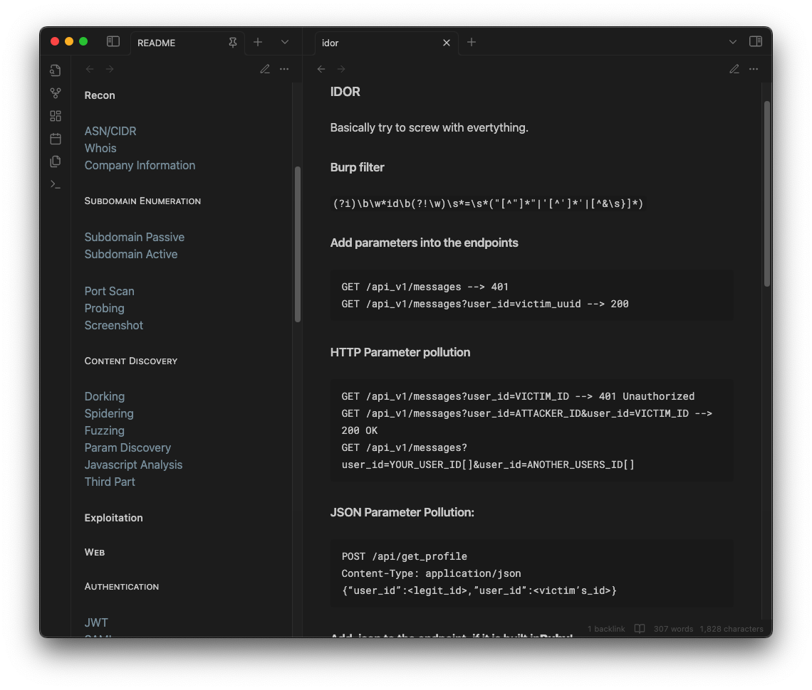

```bash
xfreerdp /v:10.129.146.69 /pth:0E14B9D6330BF16C30B1924111104824 /u:administrator
```

###### Hacking Methodology
```
It is highly recommended to open this document with Obsidian.

All the information here and on the following pages was gathered through reading articles and books, as well as watching videos and talks. None of this content is exclusive, so feel free to copy and share it freely.
```


#### Infra
##### Recon
[ASN/CIDR](infra/recon/asn-cidr.md)
[Whois](infra/recon/whois.md)
[Company Information](infra/recon/company-information.md)
[Port Scan](infra/recon/port-scan.md)
[Enumerating Services](infra/recon/services.md)
##### Exploitation
###### Services
[Attacking Services](exploitation/infra/attacking-services.md)
[Password Attacks](exploitation/infra/password-attacks.md)
##### Helpers
[Pivoting, Tunneling, and Port Forwarding](infra/helpers/pivoting.md)
#### Web
##### Recon
[Subdomain Passive](web/recon/subdomain/passive.md)
[Subdomain Active](web/recon/subdomain/active.md)
[Probing](web/recon/probing.md)
[Screenshot](web/recon/screenshot.md)
[Dorking](web/recon/dorking.md)
[Spidering](web/recon/spidering.md)
[Fuzzing](web/recon/fuzzing.md)
[Param Discovery](web/recon/param-discovery.md)
[Javascript Analysis](web/recon/javascript-analysis.md)
[Third Part](web/recon/third-part.md)
##### Exploitation
###### Authentication
[JWT](web/exploitation/authentication/jwt.md)
[SAML](web/exploitation/authentication/saml.md)
[2FA](web/exploitation/authentication/2fa.md)
[OAuth](web/exploitation/authentication/oauth.md)
###### Bypass
[403](web/exploitation/bypass/403.md)
[WAF](web/exploitation/bypass/waf.md)
###### Cloud
[AWS](web/exploitation/cloud/aws.md)
[Azure](web/exploitation/cloud/azure.md)
[GPC](web/exploitation/cloud/gpc.md)
###### CMS
[Wordpress](web/exploitation/cms/wordpress.md)
[Others](web/exploitation/cms/others.md)
###### Vulnerabilities
[Clickjacking](web/exploitation/vulns/clickjacking.md)
[Command Injection](web/exploitation/vulns/command-injection.md)
[Cookie Based Attacks](web/exploitation/vulns/cookie-based-attacks.md)
[CORS](web/exploitation/vulns/cors.md)
[CRLF](web/exploitation/vulns/crlf.md)
[CSRF](web/exploitation/vulns/csrf.md)
[Deserialization](web/exploitation/vulns/deserialization.md)
[Host Header Injection](web/exploitation/vulns/host-header-injection.md)
[HTTP/TLS Attacks](web/exploitation/vulns/http-tls-attacks.md)
[IDOR](web/exploitation/vulns/idor.md)
[IIS](web/exploitation/vulns/iis.md)
[LDAP Injection](web/exploitation/vulns/ldap-injection.md)
[LFI](web/exploitation/vulns/lfi.md)
[NoSQL](web/exploitation/vulns/nosql.md)
[Open Redirect](web/exploitation/vulns/open-redirect.md)
[Parameter Pollution](web/exploitation/vulns/parameter-pollution.md)
[Path Traversal](web/exploitation/vulns/path-traversal.md)
[PDF Generation Vulnerabilities](web/exploitation/vulns/pdf-generation.md)
[Prototype Pollution](web/exploitation/vulns/prototype-pollution.md)
[Request Smuggling](web/exploitation/vulns/request-smuggling.md)
[RCE](web/exploitation/vulns/rce.md)
[Session Puzzling](web/exploitation/vulns/session-puzzling.md)
[SSI](web/exploitation/vulns/ssi.md)
[SSTI](web/exploitation/vulns/ssti.md)
[SSRF](web/exploitation/vulns/ssrf.md)
[SQLi](web/exploitation/vulns/sqli.md)
[Timing Attacks and Race Condition](web/exploitation/vulns/timing-attacks-race-conditions.md)
[X-Path Injection](web/exploitation/vulns/x-path-injection.md)
[XSLT Injection](web/exploitation/vulns/xslt-injection.md)
[XSS](web/exploitation/vulns/xss.md)
[XXE](web/exploitation/vulns/xxe.md)
[Web Cache Poisoning](web/exploitation/vulns/cache-poisoning.md)
WebSocket Attacks (XSS, SQLi, Cross-Site WebSocket Hijacking (CSWH)) {Planned}
[Whitebox Pentesting](web/exploitation/vulns/whitebox-pentesting.md)
##### Helpers
[Brute Force](web/helpers/brute-force.md)
[Web Technologies](web/helpers/web-technologies.md)
[SMS Verification](web/helpers/sms-verification.md)
[Wordpress CVE Boilerplates](web/helpers/wp-cve-boilerplate.md)
[Burp Suite](web/helpers/burp-suite.md)
[File Transfer](web/helpers/file-transfer.md)
[Shells and Payloads](web/helpers/shells-and-payloads.md)
#### Active Directory
##### Recon
[Active Directory Enumeration](active-directory/recon/enumeration.md)
##### Exploitation
##### Helpers
[Tools](exploitation/ad/tools.md)


